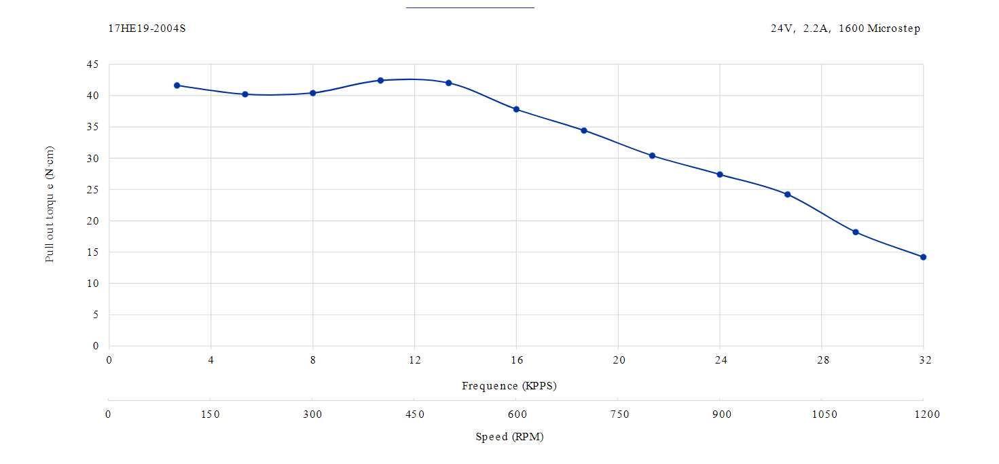

# 2StageCompoundCycloidalTorqueCalculator
### Unit under test (17HE19-2004S)
https://www.omc-stepperonline.com/e-series-nema-17-bipolar-55ncm-77-88oz-in-2a-42x48mm-4-wires-w-1m-cable-connector-17he19-2004s

####
* Electrical Specification
* Manufacturer Part Number: 17HE19-2004S
* Motor Type: Bipolar Stepper
* Step Angle: 1.8deg
* Holding Torque: 55Ncm(77.88oz.in)
* Rated Current/phase: 2.0A
* Phase Resistance: 1.3ohms
* Inductance: 2.4mH±20%(1KHz)
* Insulation Class: B 130°C[266°F]
* Physical Specification
* Frame Size: 42 x 42mm
* Body Length: 48mm
* Shaft Diameter: Φ5mm
* Shaft Length: 24mm
* D-cut Length: 15mm
* Number of Leads: 4
* Lead Length: 1000mm

Connections:  
A+ : Black  
A- : Blue  
B+ : Green  
B- : Red  
Please note that the wiring sequence of 17HE19-2004S and 17HS19-2004S1 is different and they cannot be directly substituted for each other.

